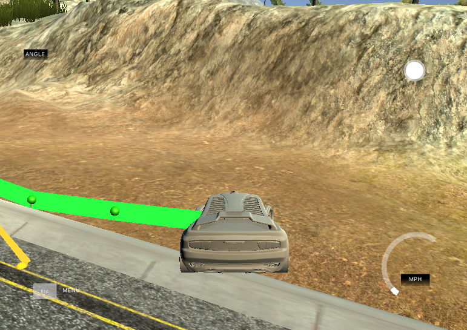
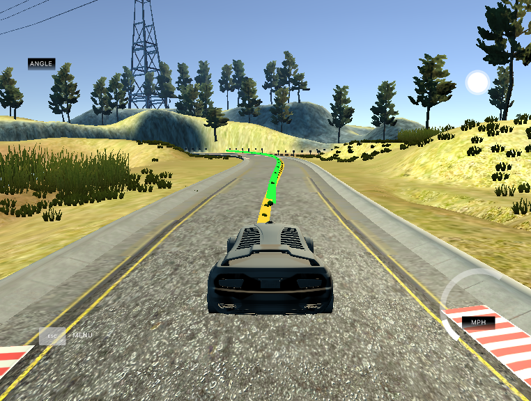

# Model Predictive Controller Project

This project was developed as part of the Udacity Self-Driving Car Engineer Nanodegree Program. The goal was to develop a Model Predictive Controller (MPC) to drive a lap around the track of the simulator.

---

## Overview

A Model Predictive Control is an approach rely on vehicle models to estimate the movement of the car and that way be able to steer and accelerate in other to achieve those predicted values. By constantly updating the state of the model and taking in consideration some things like latency, it is able to achiece good accuracy.

## Environment Setup

Instructions for setting up the environment can be found [here](setup.md). After compiling, run the executable and open the simulator on the MPC project to check it out.

## Implementation

The vehicle model that we used was a kinematic model, which means that it was a more simplified model that ignored tire forces, gravity, and mass. The throttle and steering angle were than controlled based on the an orientation error and a cross-track error. The model equations are as follows.

```
x_[t] = x[t-1] + v[t-1] * cos(psi[t-1]) * dt
y_[t] = y[t-1] + v[t-1] * sin(psi[t-1]) * dt
psi_[t] = psi[t-1] + v[t-1] / Lf * delta[t-1] * dt
v_[t] = v[t-1] + a[t-1] * dt
cte[t] = f(x[t-1]) - y[t-1] + v[t-1] * sin(epsi[t-1]) * dt
epsi[t] = psi[t] - psides[t-1] + v[t-1] * delta[t-1] / Lf * dt
```

I started out trying to adapt the code from the [mind the line quiz](https://github.com/udacity/CarND-MPC-Quizzes/tree/master/mpc_to_line) from the Model Predictive Control Lesson but didn't manage to run the simulation. So I checked the walkthrough video which gave nice insights and I was finally able to compile and run the simulation.

But my car was driving of the road just after starting:



Bothered about this mistake I went on to the discussions and discovered that I had to invert the steering angle because of the simulator. After changing this two things, my car was able to drive a lap around the track!

The choice of the timestep length (N) and elapsed duration between timesteps (dt) was done by manually tuning and these values together with the latency, which represents the delay between the actuation and the execution. I noticed that when the values of `dt` were smaller than the latency the car went crazy. That makes sense, because it means that when the actuation executes teh state is way different than when the updates were made.

When `dt` was just a bit bigger however, the controller didn't try to actuate all the time and this was good since the track has a lot of straight lines and we don't want to constantly compensate for small cross-track errors.

The `N` value was chosen keeping in mind that the controller shouldn't predict too much ahead as it mind encounter different situations and have to change its path. At the end I found that `N=15` and `dt=0.2` were values that drove very smoothly around the track.



### Author

Diogo Loreto Leal, Self-Driving Car Engineer Nanodegree Student
